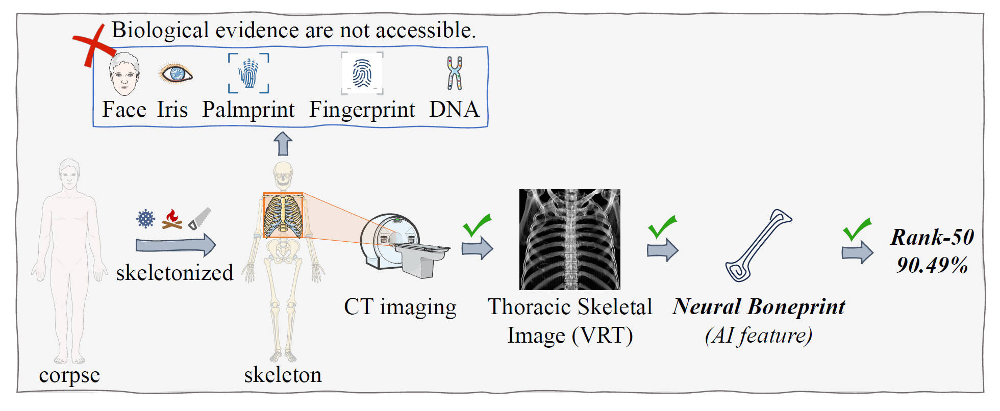
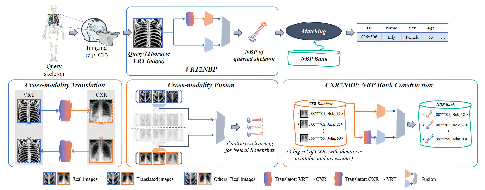
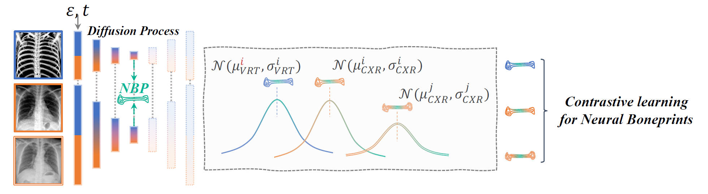

# Neural-Boneprint

***Person Identification from Bones using Generative Contrastive Deep Learning***

***

## Abstract

Forensic person identification is of paramount importance in accidents and criminal investigations. Existing methods based on soft tissue or DNA can be unavailable if the body is badly decomposed, white-ossified, intentionally destroyed, or charred. Fortunately, bones persist for a long time, raising a natural question: ***can we learn to identify a person using bone data?*** To address this, we consider two fundamental questions: First, which skeletal data should be utilized? Second, what features should be extracted for identification, and how? We present a novel skeletal feature named ***Neural Boneprint*** for personal identification. In particular, we exploit the thoracic skeletal data including chest radiographs (CXRs) and computed tomography (CT) images enhanced by the volume rendering technique (VRT) as an example to explore the viability of the neural boneprint. We represent the neural boneprint as a latent embedding of VRT images and CXRs through generative contrastive deep learning with two implementation approaches presented. Preliminary experimental results on real skeletal data demonstrate the effectiveness of the Neural Boneprint for identification. We hope this framework will provide a promising alternative for challenging forensic cases with limited conventional methods.  



Figure 1: When the corpse was deeply skeletonized (highly decomposed, burned, or deliberately destroyed), biological evidence involving soft tissue or DNA is not available. We present Neural Boneprints for person identification by taking the thoracic skeleton as an example.

## Approaches
### Two-Stage Method


Figure 2: Top: Query phase. For a query skeletal corpse, we obtain the query NBP from the query skeletal data (VRT image) in the **VRT2NBP** process. Then match the query NBP with the nearest one in the NBP bank. Bottom: Training phase of the cross-modality translation and cross-modality fusion modules, and construction of the NBP bank via the **CXR2NBP** process.

### One-Stage Method


Figure 3: One-stage approach based on diffusion method.

## Evaluation
First, install [PyTorch 2.0.1](https://pytorch.org/) (or later) and torchvision, as well as small additional dependencies, and then install this repo as a Python package. On a CUDA GPU machine, the following will do the trick:

```bash
conda install pytorch==2.0.1 torchvision==0.15.2 torchaudio==2.0.2 pytorch-cuda=11.7 -c pytorch -c nvidia
pip install git+https://github.com/CheltonNiu/Neural-Boneprint.git
```

Then click [here](https://drive.google.com/drive/folders/1wgq6s6WmrCtUZi0dS9ZXZ3Nbsaxff9_l?usp=sharing) to require NBPs of the test set and the bank encoded by different methods for increased evaluation:

```bash
python evaluation.py --method all
```

- `method`: Methods for evaluation. <u>*(str) default: all.*</u>
- `distractor_bank`: The distraction bank.  <u>*(str) default: Bank-ChestXray8-Nofindings-PA-Crop.*</u> The bank is constructed from [ChestX-ray8](https://openaccess.thecvf.com/content_cvpr_2017/html/Wang_ChestX-ray8_Hospital-Scale_Chest_CVPR_2017_paper.html).
- `distractor_num_list`: The number list of increased distractor. <u>*(str) default: [0, 1000, 5000, 10000].*</u>
- `k_list`: The *k* list of Rank-*k*. <u>*(str) default: [1, 10, 20, 50].*</u>
- `mask`: Mask ratio. <u>*(str) default: 0.*</u>

And you will get:
```text
-----------------------------------------------------------------------------------------------------------------------------------------------------------
|                         |                                                        Rank-k Rate(%)                                                         |
|          Method         |      |NBP-Bank|=263 (+0)      |        +1k distractors        |        +5k distractors        |        +1k distractors        |
|                         |  k=1  | k=10  | k=20  | k=50  |  k=1  | k=10  | k=20  | k=50  |  k=1  | k=10  | k=20  | k=50  |  k=1  | k=10  | k=20  | k=50  |
-----------------------------------------------------------------------------------------------------------------------------------------------------------
|           LbA           | 0.76  | 4.94  | 8.75  | 24.33 | 0.76  | 4.18  | 8.75  | 23.57 | 0.76  | 4.56  | 8.75  | 25.10 | 0.38  | 4.18  | 8.37  | 24.33 |
|    MobileFaceNet-CMT    | 11.79 | 38.78 | 52.85 | 68.06 | 8.37  | 23.19 | 29.66 | 40.68 | 4.94  | 14.07 | 18.63 | 26.24 | 3.42  | 12.17 | 15.21 | 20.91 |
|         Triplet         | 0.38  | 4.94  | 12.55 | 27.76 | 0.38  | 4.18  | 7.98  | 20.53 | 0.38  | 3.80  | 7.60  | 17.87 | 0.38  | 3.80  | 7.22  | 17.11 |
|     IResNet-18-CMT      | 3.80  | 14.45 | 20.15 | 35.74 | 1.14  | 8.37  | 12.17 | 15.59 | 0.38  | 3.42  | 5.32  | 10.27 | 0.38  | 2.28  | 3.42  | 5.32  |
| Real-CXR-translated-VRT | 0.38  | 2.66  | 6.08  | 19.39 | 0.00  | 0.00  | 0.00  | 0.00  | 0.00  | 0.00  | 0.00  | 0.00  | 0.00  | 0.00  | 0.00  | 0.00  |
|    One-Stage (Ours)     | 6.46  | 35.36 | 52.09 | 81.37 | 3.80  | 18.63 | 27.76 | 41.06 | 3.80  | 12.55 | 16.73 | 23.95 | 3.04  | 9.51  | 13.69 | 18.63 |
|       IResNet-18        | 3.04  | 8.75  | 14.83 | 36.50 | 1.14  | 2.66  | 5.70  | 9.13  | 1.14  | 2.28  | 2.66  | 4.94  | 0.76  | 1.90  | 2.28  | 4.18  |
|     Real-Augmented      | 3.04  | 19.77 | 28.14 | 49.05 | 1.52  | 4.18  | 6.08  | 11.03 | 0.38  | 1.52  | 1.90  | 4.18  | 0.38  | 1.14  | 1.52  | 2.28  |
|      MobileFaceNet      | 3.42  | 19.39 | 30.80 | 44.49 | 2.28  | 10.65 | 19.39 | 30.04 | 2.28  | 8.75  | 11.03 | 18.63 | 2.28  | 7.22  | 8.75  | 14.07 |
|     Triplet-CMT-VRT     | 5.70  | 27.76 | 39.54 | 62.36 | 2.28  | 8.37  | 13.69 | 27.00 | 1.14  | 4.56  | 6.08  | 9.51  | 1.14  | 3.42  | 4.94  | 6.46  |
|    Two-Stage (Ours)     | 21.29 | 64.64 | 79.09 | 90.49 | 11.03 | 36.50 | 49.05 | 63.88 | 8.37  | 26.62 | 33.84 | 46.39 | 6.84  | 21.67 | 27.76 | 39.92 |
|       IResNet-50        | 2.28  | 10.27 | 15.97 | 29.66 | 0.38  | 3.42  | 7.98  | 12.17 | 0.00  | 1.52  | 2.66  | 5.70  | 0.00  | 1.14  | 1.90  | 3.80  |
|     IResNet-50-CMT      | 3.42  | 12.93 | 18.63 | 35.36 | 1.52  | 7.22  | 9.89  | 15.21 | 0.38  | 3.42  | 5.70  | 7.60  | 0.38  | 1.52  | 3.80  | 6.08  |
|     Triplet-CMT-CXR     | 2.66  | 16.73 | 28.90 | 52.85 | 0.38  | 3.04  | 5.32  | 11.79 | 0.00  | 0.76  | 1.14  | 3.80  | 0.00  | 0.38  | 1.14  | 1.52  |
-----------------------------------------------------------------------------------------------------------------------------------------------------------
```

More code will be released soon...

```text
@inproceedings{niu2024neural,
  title={Neural Boneprint: Person Identification from Bones Using Generative Contrastive Deep Learning},
  author={Niu, Chaoqun and Chen, Dongdong and Zhou, Jizhe and Wang, Jian and Luo, Xiang and Liu, Quan-Hui and Li, Yuan and Lv, Jiancheng},
  booktitle={Proceedings of the 32nd ACM International Conference on Multimedia},
  pages={7609--7618},
  year={2024}
}
```